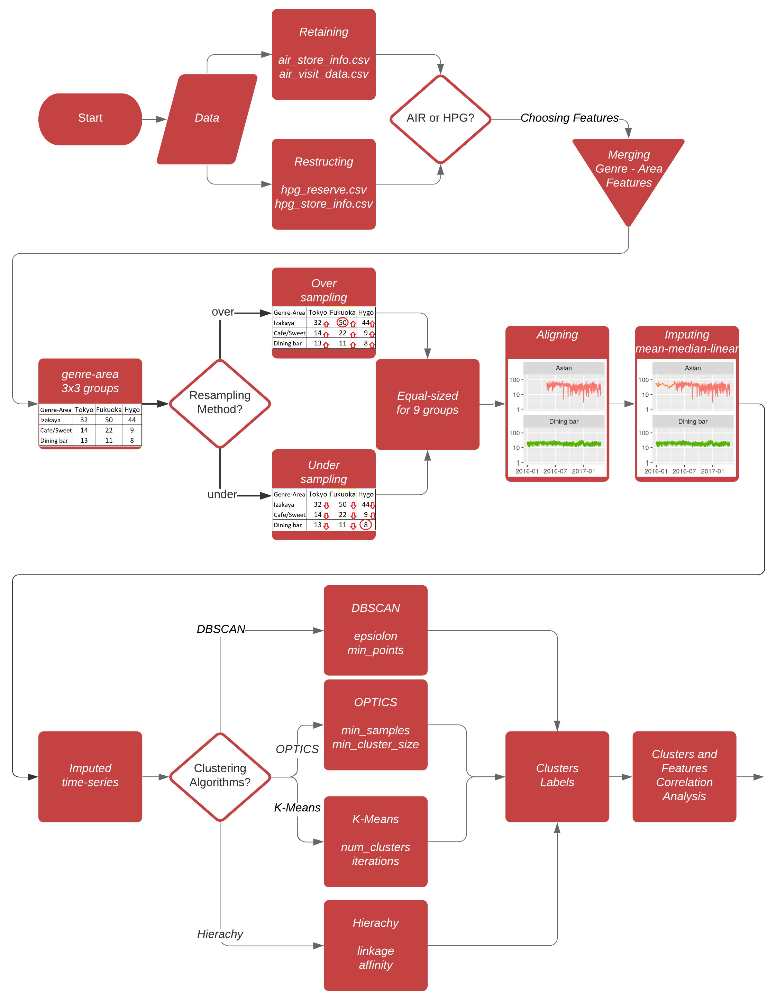

# Clustering of Discrete Time Series with Missing Values

## Introduction

The main goal of this research is mining meaningful phenomena by dividing data points into a number of groups based on their similarities, and simultaneously, separate them based on their dissimilarities. We will be discussing the group mechanism known as clustering. Without prior awarded the number of clusters, we use different types of clustering methods and techniques to distinguish groups in the population of data.

Clustering techniques are diverse and can be categorized in types: hard versus fuzzy cluster-ing, in algorithm models: connectivity, centroid, distribution, and density. Some isolate various density regions and assign the data points within these regions, or derived for similarity by the closeness of a data point to the centroid of the clusters. These are known as density models and K-means clustering respectively. We will take a closer look at DBSCAN and OPTICS of density-based clustering with its abilities to model multiple covariance structures and test each.

## Flowchart
{ width=60% }
